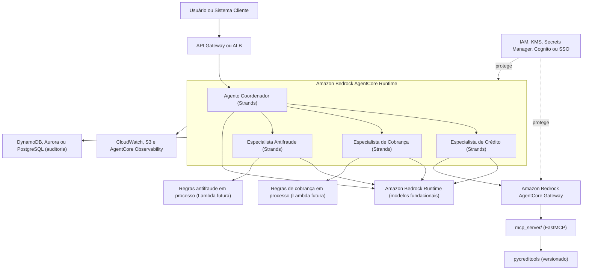

# Sistema Multiagente com Strands Agents + Clean Architecture

> Documento técnico de arquitetura-alvo.
> Padrão de orquestração: **Agents as Tools** (delegação hierárquica).
> Política de crédito entregue ao agente via **servidor MCP já existente** (`mcp_server/`); regras de cobrança e antifraude via import direto em processo.
>
> Stack:
> - Python 3.10+
> - Strands Agents SDK (camada de orquestração multiagente)
> - Clean Architecture (padrão iA16)
> - Amazon Bedrock Runtime (acesso aos modelos fundacionais)
> - Amazon Bedrock AgentCore Runtime (hospedagem dos agentes)
> - Amazon Bedrock AgentCore Gateway (exposição segura de tools, APIs, Lambdas e MCP)
> - MCP (boundary de integração da política de crédito — implementado em `mcp_server/`)
> - `pycreditools` como pacote versionado de política de crédito

---

## 1. O que estamos construindo

Um sistema onde o usuário conversa com **um único agente coordenador**. Ele classifica a intenção do pedido, decide qual especialista acionar, delega a subtarefa, recebe a resposta estruturada e devolve uma resposta consolidada ao usuário. Os especialistas nunca falam diretamente com o usuário.

Quatro agentes:

| Agente | Papel | Quando é acionado |
|---|---|---|
| **Coordenador** | Classifica a intenção e roteia | Sempre. É a porta de entrada. |
| **Crédito** | Avalia limite, score e política de crédito | Pedido de análise ou concessão de crédito |
| **Cobrança** | Define régua e estratégia de cobrança | Inadimplência, negociação, lembrete de pagamento |
| **Antifraude** | Avalia risco de fraude do cadastro ou transação | Onboarding, transação suspeita, validação de identidade |

O usuário pergunta uma vez. O coordenador pode acionar um, dois ou os três especialistas, na ordem que a classificação indicar, e só então responde.

Papel dos agentes nesta arquitetura: eles **orquestram, consultam, explicam e consolidam**. Eles não são a fonte da regra de negócio.

---

## 2. A decisão de arquitetura mais importante

**O LLM não decide regra de negócio. Ele decide fluxo.**

A política de crédito, a régua de cobrança e as regras antifraude são **código determinístico**, testável, versionado e auditável. O agente especialista é apenas um adaptador que:

1. recebe a subtarefa do coordenador,
2. chama a regra determinística (tools do MCP de crédito via `mcp_server/`, ou serviço de domínio em processo, nos demais),
3. retorna uma saída estruturada (não texto livre).

Isso resolve três problemas de uma vez:

- **Auditoria e compliance (LGPD, regras de bureau):** toda decisão de crédito ou bloqueio tem um caminho de código rastreável, não depende da geração do modelo.
- **Teste:** a regra de negócio é uma função pura, testável com unit test sem chamar o modelo.
- **Custo e latência:** o que é determinístico não consome token nem espera o modelo.

```
┌────────────────────────────────────────────────┐
│  AGENTE (Strands)  ->  decide QUANDO e O QUE     │
│  chamar. Classifica, roteia, consulta, explica.  │
├────────────────────────────────────────────────┤
│  REGRA (código determinístico)  ->  decide a     │
│  REGRA. Testável, versionada, auditável, sem LLM.│
└────────────────────────────────────────────────┘
```

### Importante: o que reduz alucinação é o determinismo, não o MCP

O MCP é apenas um boundary de integração quando faz sentido isolar o ativo. O que reduz alucinação é a regra de negócio estar em código determinístico, testado, versionado e auditável — vale tanto via MCP quanto via import direto.

Neste projeto:

- **Crédito via MCP (`mcp_server/`):** a política de crédito está em `pycreditools`, um pacote versionado com ciclo de release próprio. O servidor MCP expõe suas ferramentas (`simulate_credit_policy`, `predict_credit_decision`, `optimize_score_cutoffs`, etc.) ao agente especialista. Vale o contrato estável e o isolamento.
- **Cobrança e antifraude via import direto em processo:** vivem no mesmo deploy, mudam junto com o sistema, e não precisam do overhead de um servidor separado neste momento.

---

## 3. Como o Strands implementa isso

O Strands chama esse padrão de **Agents as Tools**. Cada especialista é exposto ao coordenador como uma ferramenta via o decorator `@tool`. O coordenador é um `Agent` que recebe essas ferramentas na lista `tools`.

Fluxo:

```
Usuário
   │
   ▼
Coordenador (Agent)
   │  classifica a intenção pelas descrições das tools e decide
   ├──► especialista_credito(...)      -> [MCP] mcp_server/ -> pycreditools (versionado)
   ├──► especialista_cobranca(...)     -> CobrancaService -> Régua de Cobrança (em processo)
   └──► especialista_antifraude(...)   -> AntifraudeService -> Regras Antifraude (em processo)
   │
   ▼ consolida as saídas estruturadas
Usuário
```

Detalhe que mais quebra na prática: **a docstring de cada `@tool` é o que o coordenador lê para classificar e escolher o especialista.** Ela precisa ser clara e descrever exatamente quando aquele especialista deve ser acionado.

---

## 4. Estrutura de pastas (Clean Architecture iA16)

```
multiagentes/
├── app/
│   ├── core/                       # configuração e infra transversal
│   │   ├── config.py               # variáveis de ambiente (.env)
│   │   ├── model_provider.py       # provider do modelo (Bedrock Runtime)
│   │   ├── aws_clients.py          # clients boto3 (bedrock-runtime, dynamodb, etc)
│   │   └── errors.py               # erros padronizados
│   │
│   ├── domain/                     # CAMADA DE DOMÍNIO (pura, sem framework)
│   │   ├── entities.py             # Cliente, Proposta, Transacao...
│   │   ├── cobranca/
│   │   │   └── regua.py            # régua determinística de cobrança
│   │   └── antifraude/
│   │       └── regras.py           # regras determinísticas antifraude
│   │   # OBS: a política de crédito NÃO fica aqui. Vive em pycreditools,
│   │   #      consumido via servidor MCP (mcp_server/).
│   │
│   ├── application/                # CASOS DE USO (orquestram domínio + repos)
│   │   ├── cobranca_service.py
│   │   └── antifraude_service.py
│   │   # crédito não tem service aqui: o agente fala direto com o MCP.
│   │
│   ├── agents/                     # CAMADA DE ADAPTAÇÃO (Strands)
│   │   ├── especialista_credito.py     # consome o mcp_server/
│   │   ├── especialista_cobranca.py    # import direto
│   │   ├── especialista_antifraude.py  # import direto
│   │   └── coordenador.py
│   │
│   ├── infrastructure/             # repositórios e integrações externas
│   │   ├── repositories.py         # acesso a banco (único lugar que toca o DB)
│   │   ├── bureau_credito.py       # API externa de bureau
│   │   ├── uazapi.py               # WhatsApp para envio de cobrança
│   │   ├── dynamodb_auditoria.py   # trilha de auditoria estruturada
│   │   ├── secrets.py              # leitura de credenciais no Secrets Manager
│   │   └── observability.py        # log estruturado + traces (CloudWatch)
│   │
│   └── api/
│       └── main.py                 # entrypoint (FastAPI ou handler AgentCore)
│
├── mcp_server/                     # SERVIDOR MCP (já implementado)
│   ├── server.py                   # FastMCP — expõe as tools do pycreditools
│   └── README.md
│
├── pycreditools/                   # PACOTE VERSIONADO DE POLÍTICA DE CRÉDITO
│   ├── pyproject.toml
│   └── src/pycreditools/           # simulate, optimize, deploy, grouping, stress...
│
├── deploy/                         # INFRAESTRUTURA E DEPLOY
│   ├── agentcore/                  # config de deploy no AgentCore Runtime
│   ├── ecs/                        # task definitions / Fargate (alternativa)
│   ├── lambda/                     # handlers Lambda (cobrança/antifraude futuras)
│   └── terraform/                  # IaC: IAM, KMS, DynamoDB, Gateway, etc
│
├── tests/
│   ├── test_regua_cobranca.py      # testa regra SEM chamar o modelo
│   └── test_regras_antifraude.py
├── .env.example
└── README.md
```

Regra de ouro das camadas:

```
agents/          depende de  application/  (e do contrato MCP, no caso do crédito)
application/     depende de  domain/  e  infrastructure/ (por interface)
domain/          não depende de NADA (puro Python)
infrastructure/  implementa o que domain/ e application/ precisam
```

A camada `domain/` nunca importa Strands, nunca importa banco, nunca importa FastAPI. Ela é Python puro.

---

## 4-A. MCP ou import direto: o critério

| Critério | Use **MCP** (processo separado) | Use **import direto** (`@tool` em processo) |
|---|---|---|
| Quem mantém a regra | Outro time, ciclo de release próprio | Mesmo time, mesmo deploy |
| Reuso | Vários sistemas consomem (agente, batch, API) | Só este sistema usa |
| Isolamento | Quer processo, escala ou sandbox separado | Não precisa |
| Contrato | Quer contrato versionado e estável | Acoplamento interno é aceitável |
| Custo operacional | Aceita servidor, auth e timeout a mais | Quer menos peças, menor latência |

Neste projeto:

- **Política de crédito via MCP (`mcp_server/`):** `pycreditools` é ativo versionado com ciclo de release próprio. O servidor MCP o expõe ao agente especialista. Ganhamos contrato estável e isolamento.
- **Cobrança e antifraude via import direto:** vivem no mesmo deploy. Um servidor MCP só para elas seria overhead sem retorno neste momento.

---

## 5. Código de referência, camada por camada

> Os exemplos abaixo são referência conceitual. Validar imports, nomes de classes e assinatura dos métodos contra a versão exata do Strands Agents SDK adotada no projeto.

### 5.1. `core/model_provider.py`

```python
from strands.models import BedrockModel

def get_model():
    """Retorna o modelo configurado para todos os agentes.
    Trocar de provider (Bedrock, Anthropic API, etc) muda só aqui."""
    return BedrockModel(
        model_id="us.anthropic.claude-sonnet-4-20250514-v1:0",
        region_name="us-west-2",
        temperature=0.2,
    )
```

### 5.2. `agents/especialista_credito.py`

O especialista de crédito se conecta ao `mcp_server/` e usa suas tools (`simulate_credit_policy`, `predict_credit_decision`, etc.) para responder à subtarefa. O system prompt instrui o agente a usar as tools do MCP e a devolver um contrato estruturado ao coordenador — nunca texto livre, nunca decisão inventada.

```python
from strands import Agent, tool
from strands.tools.mcp import MCPClient
from mcp import stdio_client, StdioServerParameters
from app.core.model_provider import get_model

credito_mcp = MCPClient(lambda: stdio_client(
    StdioServerParameters(command="python", args=["-m", "mcp_server.server"])
))

CREDITO_PROMPT = """
Voce e o especialista de credito. Para QUALQUER analise, use as ferramentas
MCP disponiveis (simulate_credit_policy, predict_credit_decision, etc.).
Nunca decida por conta propria e nunca invente numeros.
Devolva o contrato estruturado (decisao, limite, risco, motivos, regras
aplicadas, versao da politica) sem alterar os valores retornados pelas ferramentas.
"""

def rodar_credito(subtarefa: str) -> dict:
    with credito_mcp:
        agente = Agent(
            model=get_model(),
            system_prompt=CREDITO_PROMPT,
            tools=credito_mcp.list_tools_sync(),
        )
        return agente.structured_output(dict, subtarefa)

@tool
def especialista_credito(cliente_id: str, score: int, renda_mensal: float,
                         divida_atual: float, tem_restricao: bool) -> dict:
    """Analisa a concessao de credito de um cliente via politica oficial (MCP).
    Use quando o pedido envolver: aprovar credito, definir limite,
    avaliar score, ou conceder financiamento.
    Retorna o contrato minimo de decisao (dict estruturado)."""
    subtarefa = (
        f"Avalie o credito do cliente {cliente_id} com score {score}, "
        f"renda {renda_mensal}, divida {divida_atual}, "
        f"restricao={tem_restricao}."
    )
    return rodar_credito(subtarefa)
```

### 5.3. `agents/especialista_cobranca.py`

```python
from strands import tool
from app.application.cobranca_service import definir_estrategia_cobranca

@tool
def especialista_cobranca(cliente_id: str) -> dict:
    """Define a estrategia de cobranca de um cliente inadimplente.
    Use quando o pedido envolver: cobranca, atraso de pagamento,
    negociacao de divida, ou regua de comunicacao.
    Retorna o contrato minimo de decisao (dict estruturado)."""
    e = definir_estrategia_cobranca(cliente_id)
    return {
        "decisao": e.decisao,
        "classificacao_risco": e.classificacao_risco,
        "motivos": e.motivos,
        "regras_aplicadas": e.regras_aplicadas,
        "versao_politica": e.versao_regua,
        "acoes_recomendadas": e.acoes_recomendadas,
        "necessita_revisao_humana": e.necessita_revisao_humana,
        "nivel_confianca": e.nivel_confianca,
        "dados_insuficientes": e.dados_insuficientes,
    }
```

Régua determinística em `domain/cobranca/regua.py`:

```python
from dataclasses import dataclass

@dataclass
class EstrategiaCobranca:
    decisao: str
    classificacao_risco: str
    motivos: list
    regras_aplicadas: list
    versao_regua: str
    acoes_recomendadas: list
    necessita_revisao_humana: bool
    nivel_confianca: float
    dados_insuficientes: bool

VERSAO_REGUA = "regua-2026.05"

def definir_regua(dias_atraso: int, e_bom_pagador: bool) -> EstrategiaCobranca:
    if dias_atraso <= 5:
        return EstrategiaCobranca(
            "lembrete_gentil", "baixo", ["Atraso recente"], ["COB-001"],
            VERSAO_REGUA, ["Enviar lembrete por WhatsApp"], False, 0.95, False,
        )
    if dias_atraso <= 30:
        return EstrategiaCobranca(
            "negociar", "medio", ["Atraso moderado"], ["COB-002"],
            VERSAO_REGUA, ["Oferecer negociacao"], False, 0.9, False,
        )
    if dias_atraso <= 90:
        return EstrategiaCobranca(
            "negociar_com_desconto", "alto", ["Atraso relevante"], ["COB-003"],
            VERSAO_REGUA, ["Negociar com desconto", "Contato telefonico"], False, 0.85, False,
        )
    return EstrategiaCobranca(
        "encaminhar_juridico", "alto", ["Atraso acima de 90 dias"], ["COB-004"],
        VERSAO_REGUA, ["Encaminhar para protesto"], True, 0.8, False,
    )
```

### 5.4. `agents/especialista_antifraude.py`

```python
from strands import tool
from app.application.antifraude_service import avaliar_risco_fraude

@tool
def especialista_antifraude(cliente_id: str) -> dict:
    """Avalia o risco de fraude de um cliente ou transacao.
    Use quando o pedido envolver: validar identidade, onboarding suspeito,
    transacao atipica, ou verificacao de cadastro.
    Retorna o contrato minimo de decisao (dict estruturado)."""
    risco = avaliar_risco_fraude(cliente_id)
    return {
        "decisao": risco.decisao,
        "classificacao_risco": risco.classificacao_risco,
        "motivos": risco.motivos,
        "regras_aplicadas": risco.regras_aplicadas,
        "versao_politica": risco.versao_regras,
        "acoes_recomendadas": risco.acoes_recomendadas,
        "necessita_revisao_humana": risco.necessita_revisao_humana,
        "nivel_confianca": risco.nivel_confianca,
        "dados_insuficientes": risco.dados_insuficientes,
    }
```

### 5.5. `agents/coordenador.py`

```python
from strands import Agent
from app.core.model_provider import get_model
from app.agents.especialista_credito import especialista_credito
from app.agents.especialista_cobranca import especialista_cobranca
from app.agents.especialista_antifraude import especialista_antifraude

COORDENADOR_PROMPT = """
Voce e o agente coordenador de um sistema financeiro.
O usuario fala apenas com voce. Sua funcao:

1. Classificar a intencao do pedido com base nas descricoes das ferramentas.
2. Acionar os especialistas adequados (um ou mais), na ordem que a
   classificacao indicar. Ex: antes de aprovar credito, checar antifraude.
3. Consolidar as SAIDAS ESTRUTURADAS dos especialistas em uma resposta clara.
4. NUNCA criar decisao de credito, cobranca ou fraude. Voce nao decide regra
   de negocio. Voce roteia, consulta, explica e consolida.
5. Se qualquer especialista indicar necessita_revisao_humana=true, ou se houver
   divergencia entre especialistas, ou dados_insuficientes=true, encaminhar para
   revisao humana e deixar isso explicito na resposta.

Sempre baseie a resposta no retorno estruturado dos especialistas.
Responda em portugues, de forma direta.
"""

def criar_coordenador() -> Agent:
    return Agent(
        model=get_model(),
        system_prompt=COORDENADOR_PROMPT,
        tools=[
            especialista_credito,
            especialista_cobranca,
            especialista_antifraude,
        ],
    )
```

### 5.6. `api/main.py`

```python
from app.agents.coordenador import criar_coordenador

def main():
    coordenador = criar_coordenador()
    print("Sistema multiagente pronto. Digite 'sair' para encerrar.")
    while True:
        pergunta = input("\nVoce: ")
        if pergunta.strip().lower() == "sair":
            break
        resposta = coordenador(pergunta)
        print(f"\nCoordenador: {resposta}")

if __name__ == "__main__":
    main()
```

---

## 6. Contrato mínimo de decisão dos especialistas

Nenhum especialista deve retornar apenas texto livre. Todo especialista (crédito, cobrança, antifraude) deve retornar, no mínimo:

| Campo | Tipo | O que é |
|---|---|---|
| `decisao` | string | A decisão tomada pela regra, em valor controlado (ex: `aprovado`, `aprovado_com_limite_menor`, `negociar_com_desconto`, `bloquear`) |
| `classificacao_risco` | string | `baixo`, `medio` ou `alto` |
| `motivos` | lista de string | Justificativas legíveis da decisão |
| `regras_aplicadas` | lista de string | Códigos das regras que dispararam (ex: `CRED-001`) |
| `versao_politica` | string | Versão da política ou régua aplicada (ex: `2026.06.1`) |
| `acoes_recomendadas` | lista de string | O que fazer a seguir |
| `necessita_revisao_humana` | bool | Se a decisão deve passar por uma pessoa antes de valer |
| `nivel_confianca` | número | 0.0 a 1.0, quão confiável é a decisão dado os dados |
| `dados_insuficientes` | bool | Presente quando faltam dados para uma decisão segura |

Por que esse contrato importa:

- **Auditoria:** cada decisão carrega regras aplicadas e versão da política.
- **Testes:** o contrato é estável — o teste compara campos, não frases.
- **Consolidação pelo coordenador:** o coordenador lê campos, não interpreta texto.
- **Integração futura:** o mesmo contrato serve para banco, API e painel de revisão humana.

---

## 7. Quando exigir revisão humana

Quando qualquer especialista retornar `necessita_revisao_humana=true`, ou quando o coordenador detectar uma das situações abaixo, o caso é encaminhado para uma pessoa antes de a decisão valer:

- suspeita relevante de fraude;
- bloqueio de conta;
- negativa de crédito de alto impacto;
- divergência entre especialistas (ex: crédito aprova, antifraude sinaliza risco alto);
- dados insuficientes (`dados_insuficientes=true`);
- exceção de política;
- cliente estratégico;
- risco jurídico, regulatório ou reputacional.

O coordenador deve deixar explícito na resposta que o caso foi encaminhado para revisão humana.

---

## 8. Exemplo de fluxo

**Usuário:** "Esse cliente novo, id 4821, quer R$ 5.000 de limite. Posso liberar?"

1. Coordenador aciona `especialista_antifraude("4821")`. Retorno: `decisao=aprovar`, `classificacao_risco=baixo`, `necessita_revisao_humana=false`.
2. Como o antifraude liberou, aciona `especialista_credito(...)`. O especialista usa as tools do MCP (`predict_credit_decision` ou `simulate_credit_policy`) e devolve: `decisao=aprovado_com_limite_menor`, `limite_sugerido=4500`, `regras_aplicadas=["CRED-001","CRED-004"]`, `versao_politica=2026.06.1`, `necessita_revisao_humana=false`.
3. Coordenador consolida:

> "Cliente 4821 passou na verificação antifraude (risco baixo). Pela política de crédito versão 2026.06.1, a decisão foi aprovado com limite menor: R$ 4.500, abaixo dos R$ 5.000 solicitados (regras CRED-001 e CRED-004). Não requer revisão humana."

---

## 9. Por que Agents as Tools e não os outros padrões

| Padrão | Quando usar | Serve aqui? |
|---|---|---|
| **Agents as Tools** | Coordenador delega para especialistas, fluxo controlado | **Sim, é o nosso caso** |
| Swarm | Agentes colaboram de forma autônoma, com handoff livre | Não. Não queremos agente decidindo sozinho passar a bola |
| Graph | Fluxo com ramificação condicional fixa entre nós | Excesso para a POC |
| Workflow | Pipeline fixo e repetível, sempre na mesma ordem | Nosso fluxo varia conforme o pedido |

---

## 10. Arquitetura alvo na AWS Bedrock

```text
Strands Agents                      = coordenação multiagente
Amazon Bedrock Runtime              = chamada aos modelos fundacionais
Amazon Bedrock AgentCore Runtime    = hospedagem dos agentes
Amazon Bedrock AgentCore Gateway    = exposição segura de tools, APIs, Lambdas e MCP
mcp_server/ (pycreditools)          = boundary para política de crédito versionada
Código determinístico               = fonte da verdade para regras de negócio
```

### Não duplicar orquestração

O Amazon Bedrock Agents nativo é uma **alternativa** ao Strands, não uma camada adicional acima dele. Colocar um Bedrock Agent nativo orquestrando e, abaixo dele, um coordenador Strands, cria duplicidade de orquestração: dois cérebros decidindo roteamento, mais custo, mais latência e auditoria mais difícil.

Decisão: a orquestração multiagente fica **só no Strands**. O Bedrock entra como runtime, acesso a modelos, gateway e governança.

---

## 11. Diagrama da arquitetura AWS



---

## 12. Componentes AWS recomendados

| Necessidade | Componente AWS | Uso no projeto |
|---|---|---|
| Acesso aos modelos | Amazon Bedrock Runtime | Inferência dos agentes Strands |
| Chamada de modelo padronizada | Bedrock Converse API | Interface única de conversa e tool use |
| Hospedagem dos agentes | Amazon Bedrock AgentCore Runtime | Roda o coordenador e os especialistas |
| Exposição segura de tools | Amazon Bedrock AgentCore Gateway | Expõe MCP, APIs e Lambdas com auth e logging |
| Proteção de linguagem e dados | Amazon Bedrock Guardrails | Filtra tom, linguagem agressiva e dados sensíveis |
| Documentação consultiva | Amazon Bedrock Knowledge Bases | RAG sobre manuais e playbooks |
| Memória de sessão | AgentCore Memory | Memória curta/longa de atendimento |
| Logs e métricas | CloudWatch | Logs estruturados, métricas e traces dos agentes |
| Artefatos e exportações | S3 | Logs longos, exports e anexos de auditoria |
| Estado e trilha de auditoria | DynamoDB | Trilha de auditoria por atendimento |
| Dados relacionais | Aurora ou PostgreSQL | Estado de caso e consultas relacionais |
| Credenciais | AWS Secrets Manager | Chaves de bureau, banco, UAZAPI e tokens |
| Criptografia | AWS KMS | Criptografia de dados persistidos e do gateway |
| Permissões | IAM | Roles com privilégio mínimo por agente e por tool |
| Autenticação de usuários | Cognito ou SSO corporativo | Login do usuário final |
| Mensageria assíncrona | SQS | Fila de revisão humana |
| Eventos | EventBridge | Disparo de eventos em decisões sensíveis |
| Fluxos longos | Step Functions | Orquestração de aprovação, revisão e retentativa |
| Cargas de integração | Lambda ou ECS | Integrações com bureau, CRM, ERP e UAZAPI |

---

## 13. Componentes mínimos para POC

- Strands Agents (orquestração);
- Amazon Bedrock Runtime com Converse API (modelos);
- AgentCore Runtime ou ECS Fargate;
- `mcp_server/` rodando local ou em container;
- `pycreditools` instalado como dependência;
- cobrança e antifraude por import direto em processo;
- CloudWatch Logs;
- DynamoDB ou PostgreSQL para auditoria básica;
- Guardrail simples para proteção de linguagem e dados sensíveis.

---

## 14. Componentes para produção

- Amazon Bedrock Runtime + AgentCore Runtime;
- Amazon Bedrock AgentCore Gateway (MCP de crédito atrás do Gateway);
- Bedrock Guardrails e Knowledge Bases;
- AgentCore Memory;
- DynamoDB, Aurora ou PostgreSQL para auditoria;
- CloudWatch, S3 e AgentCore Observability;
- IAM, KMS, Secrets Manager e Cognito ou SSO;
- EventBridge, SQS e Step Functions para revisão humana;
- Lambda ou ECS para integrações com bureau, CRM, ERP e UAZAPI.

---

## 15. Observabilidade e auditoria

Por execução, registrar no mínimo:

- `id_atendimento`, `usuario_id`;
- agente coordenador, especialistas chamados, ferramentas chamadas;
- motivo do roteamento;
- entrada normalizada;
- saída estruturada de cada especialista;
- regras aplicadas, versão da política;
- decisão final consolidada;
- indicação de revisão humana;
- latência e erro, se houver.

```json
{
  "id_atendimento": "atd_2026_06_20_000182",
  "usuario_id": "usr_4821",
  "especialistas_chamados": ["antifraude", "credito"],
  "motivo_roteamento": "concessao_credito_cliente_novo",
  "saidas_especialistas": [
    {"agente": "antifraude", "decisao": "aprovar", "classificacao_risco": "baixo"},
    {"agente": "credito", "decisao": "aprovado_com_limite_menor", "limite_sugerido": 4500,
     "regras_aplicadas": ["CRED-001", "CRED-004"]}
  ],
  "versao_politica": "2026.06.1",
  "decisao_final": "aprovado_com_limite_menor",
  "necessita_revisao_humana": false,
  "latencia_ms": 2380
}
```

---

## 16. Segurança

- Uma role IAM por agente, com só o que ele precisa;
- `mcp_server/` expõe apenas as tools necessárias;
- dados sensíveis não ficam no system prompt;
- credenciais no Secrets Manager;
- dados persistidos com criptografia KMS;
- CPF, CNPJ, telefone e e-mail mascarados nos logs;
- ambientes dev, homologação e produção separados.

---

## 17. Pontos de atenção para o time

**Docstrings são contrato.** A docstring de cada `@tool` é lida pelo coordenador para classificar e rotear. Tratar como parte da lógica, revisar em PR.

**Regra de negócio fora do prompt.** Qualquer decisão de crédito, cobrança ou fraude vive em código determinístico (`pycreditools` para crédito, `domain/` para os demais). O prompt não é a fonte da verdade. Se alguém colocar regra de negócio no prompt do agente, recusar o PR.

**Teste a regra sem o modelo.** `test_regua_cobranca.py` e `test_regras_antifraude.py` rodam sem chamar o LLM. Para crédito, um teste de integração que sobe o `mcp_server/` e confere que as tools respondem no contrato esperado.

**Ciclo de vida da conexão MCP.** No Strands, tools que dependem de MCP só funcionam dentro de um context manager (`with`). Validar esse comportamento contra a versão exata do SDK.

**Contrato do MCP é público interno.** Mudanças de nome, parâmetros ou schema de retorno do `mcp_server/` exigem versionamento e validação.

---

## 18. Setup rápido para POC

```bash
python -m venv .venv
source .venv/bin/activate

pip install strands-agents strands-agents-tools mcp boto3
pip install -e "./pycreditools[mcp]"
```

Variáveis de ambiente:

```bash
AWS_REGION=us-west-2
BEDROCK_MODEL_ID=us.anthropic.claude-sonnet-4-20250514-v1:0
LOG_LEVEL=INFO
```

---

## 19. Próximos passos

1. Implementar domínio de cobrança (`domain/cobranca/regua.py`) e testes sem LLM.
2. Implementar domínio de antifraude (`domain/antifraude/regras.py`) e testes sem LLM.
3. Implementar `application/cobranca_service.py` e `application/antifraude_service.py`.
4. Validar o agente de crédito chamando o `mcp_server/` local.
5. Implementar o coordenador com os três especialistas.
6. Trocar o provider local pelo Amazon Bedrock Runtime.
7. Rodar a aplicação em container.
8. Publicar no AgentCore Runtime ou ECS Fargate.
9. Adicionar CloudWatch e auditoria estruturada.
10. Adicionar Guardrails.
11. Adicionar AgentCore Gateway para o MCP.
12. Adicionar a fila de revisão humana (SQS, EventBridge, Step Functions).
13. Promover cobrança e antifraude a Lambda ou serviço próprio apenas se houver necessidade real de escala ou isolamento.

---

## Referências oficiais

- Amazon Bedrock AgentCore: https://docs.aws.amazon.com/bedrock-agentcore/
- Get started com AgentCore (toolkit, usa Strands): https://docs.aws.amazon.com/bedrock-agentcore/latest/devguide/agentcore-get-started-toolkit.html
- Deploy de Strands Agents no AgentCore Runtime: https://strandsagents.com/docs/user-guide/deploy/deploy_to_bedrock_agentcore/python/
- AgentCore Gateway, conceitos centrais: https://docs.aws.amazon.com/bedrock-agentcore/latest/devguide/gateway-core-concepts.html
- AgentCore Memory com Strands SDK: https://docs.aws.amazon.com/bedrock-agentcore/latest/devguide/strands-sdk-memory.html
- Amazon Bedrock Converse API (boto3): https://boto3.amazonaws.com/v1/documentation/api/latest/reference/services/bedrock-runtime/client/converse.html
- Amazon Bedrock Guardrails: https://docs.aws.amazon.com/bedrock/latest/userguide/guardrails-how.html
